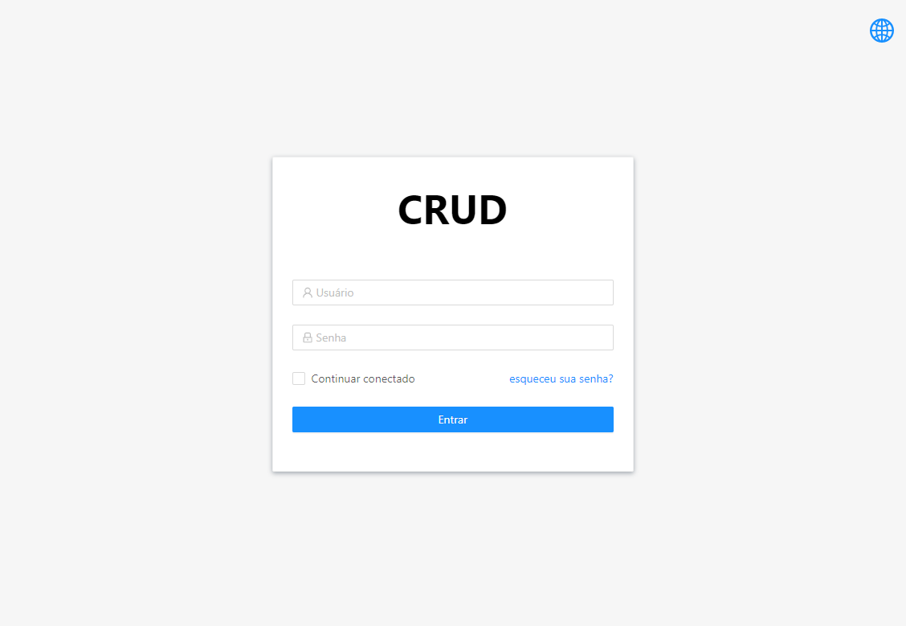
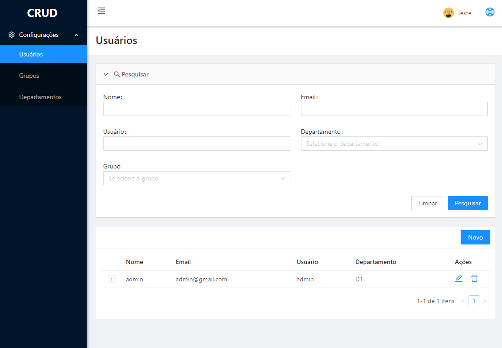

# SPRING-CRUD

> Exemplo de integração do React com Spring Boot.

_Para acessar a aplicação pela primeira vez deve ser utilizado o login: `demo` / password: `demo`, depois de criar o usuário na aplicação é possível entrar com ele._

_Obs: Foi utilizado o React-i18next para gerenciar o multi-idioma da aplicação._

## Technologies

- Front-end: React, Redux, Redux-saga, React-i18next, Axios, Ant Design.
- Back-end: Spring Web, Spring Security, Spring Data Mongo, Lombok, Querydsl, jjwt.

## Images

     

     

